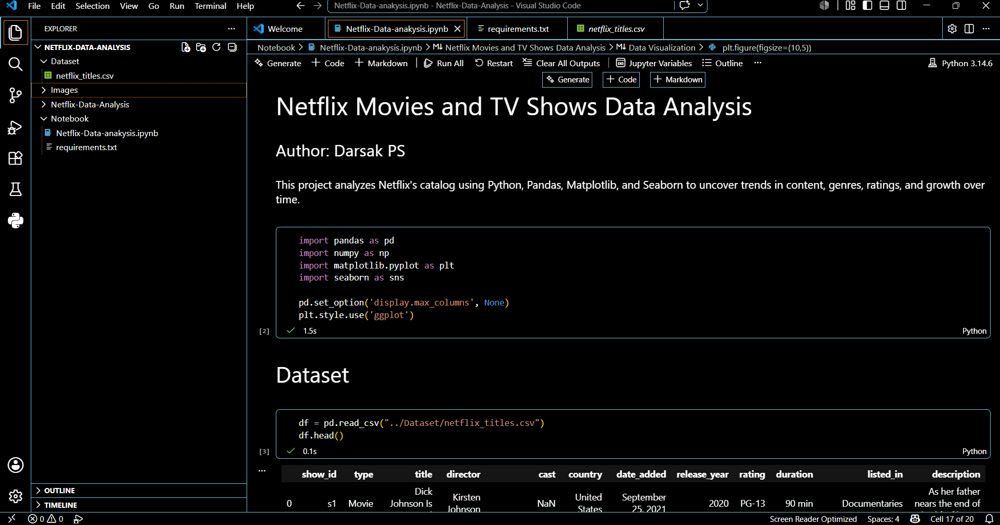
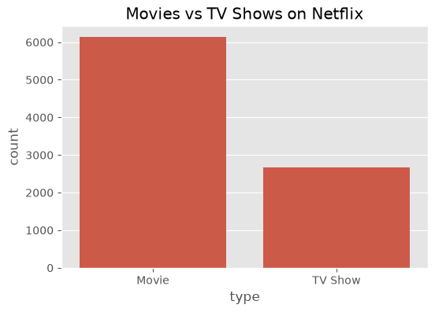
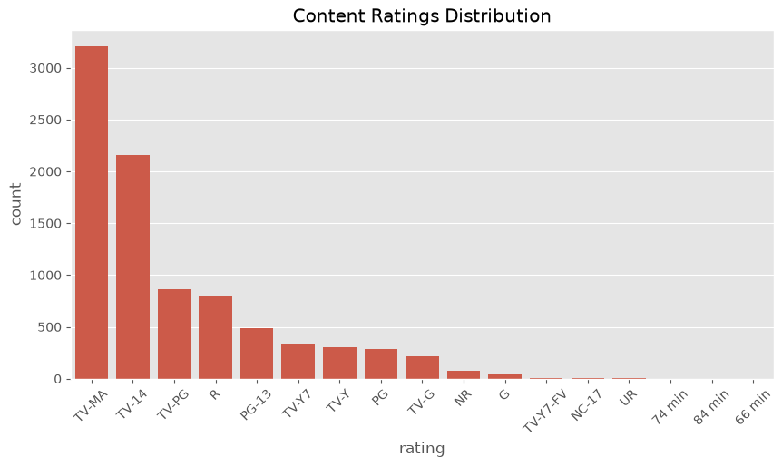
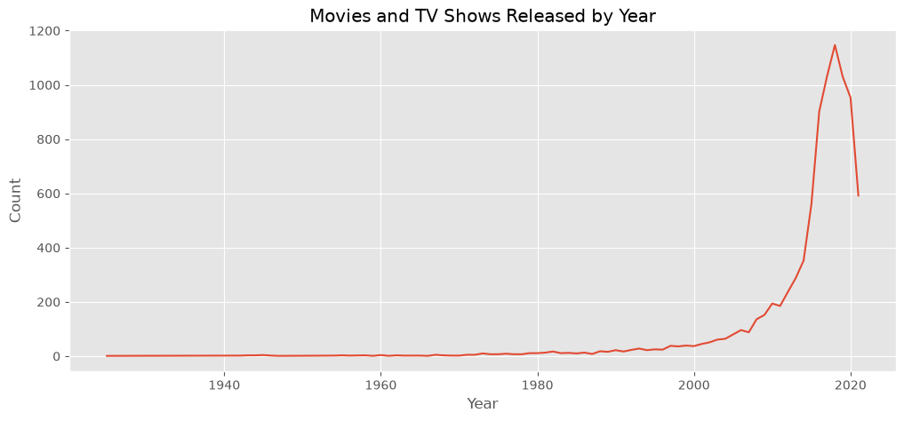
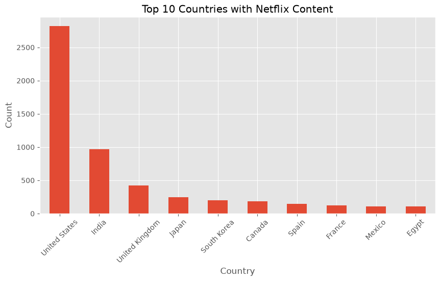
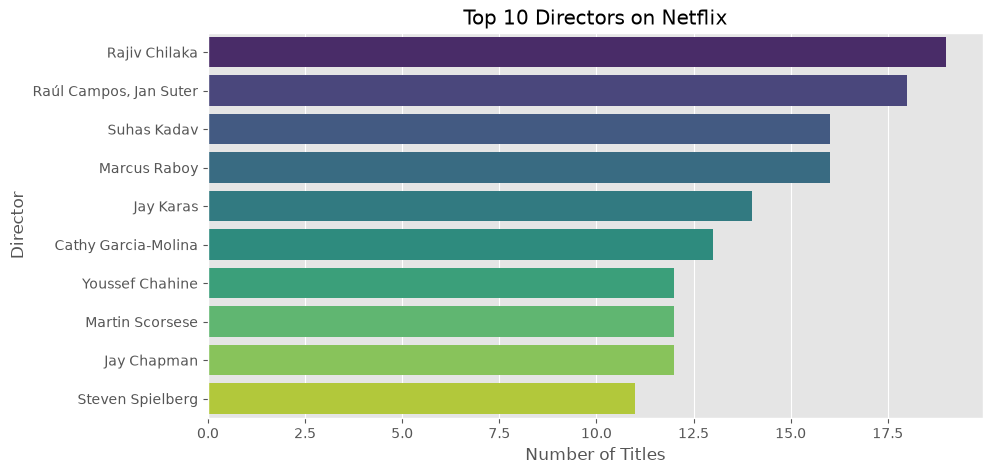
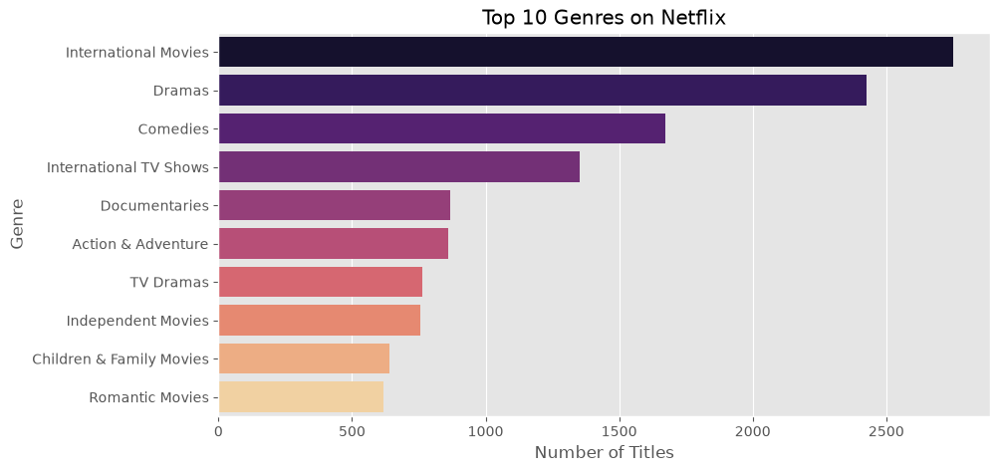
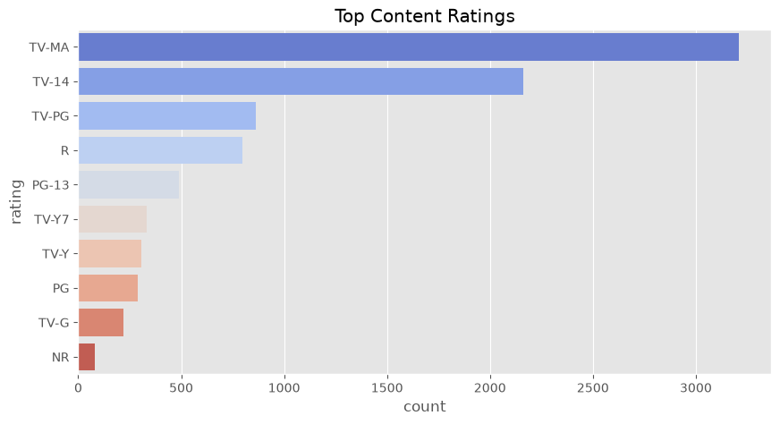
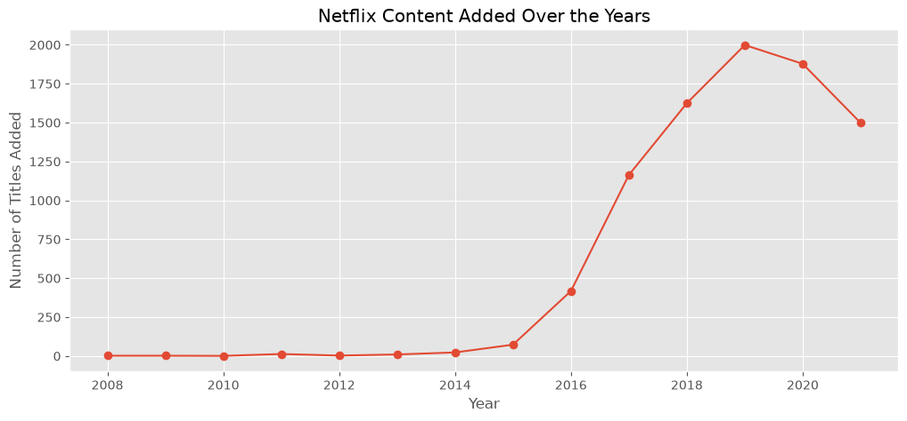

# 📊 Netflix Movies & TV Shows Exploratory Data Analysis (EDA)

## 📌 Project Overview

This project explores the Netflix Movies and TV Shows dataset using Python for Exploratory Data Analysis (EDA). The objective is to uncover trends in Netflix's content library, including content types, ratings, genres, countries, release years, and content growth over time.

## 📓 Notebook Preview

The analysis was performed in a Jupyter Notebook using Python. The notebook includes data loading, cleaning, exploratory data analysis (EDA), visualizations, and key findings.



---

## 👨‍💻 Author

**Darsak PS**

---

## 🛠️ Technologies Used

- Python
- Pandas
- NumPy
- Matplotlib
- Seaborn
- Jupyter Notebook

---

## 📂 Dataset

- Dataset: Netflix Movies and TV Shows
- File: `Dataset/netflix_titles.csv`

---

## 📊 Analysis Performed

- Data Loading
- Data Cleaning
- Missing Value Analysis
- Exploratory Data Analysis (EDA)
- Data Visualization
- Trend Analysis

---

## 📊 Project Visualizations

### Movies vs TV Shows



### Ratings Distribution



### Release Year Trend



### Top 10 Countries



### Top 10 Directors



### Top 10 Genres



## Top Content Rating



### Content Added Over the Years



---

## 💡 Key Findings

- Netflix contains more Movies than TV Shows.
- The United States contributes the highest number of titles.
- TV-MA is the most common content rating.
- Netflix's content library experienced rapid growth between 2017 and 2019.
- Drama and International Movies are among the most popular genres.

---

## 📁 Project Structure

```
Netflix-Data-Analysis/
│
├── Dataset/
│   └── netflix_titles.csv
│
├── Images/
│   ├── movies_vs_tvshows.png
│   ├── ratings_distribution.png
│   ├── release_year_trend.png
│   ├── top_10_countries.png
│   ├── top_10_directors.png
│   ├── top_10_genres.png
│   └── content_added_over_time.png
│
├── Notebook/
│   └── Netflix-Data-analysis.ipynb
│
├── requirements.txt
└── README.md
```
## 📂 Dataset Source

This project uses the **Netflix Movies and TV Shows** dataset available on Kaggle.

- **Source:** https://www.kaggle.com/datasets/shivamb/netflix-shows
- **Provider:** Shivam Bansal (Kaggle)
- **File Used:** `netflix_titles.csv`

The dataset contains information about Netflix titles, including:
- Type (Movie/TV Show)
- Title
- Director
- Cast
- Country
- Date Added
- Release Year
- Rating
- Duration
- Genre
- Description
---

## 🚀 Skills Demonstrated

- Data Cleaning
- Exploratory Data Analysis (EDA)
- Data Visualization
- Python Programming
- Pandas
- NumPy
- Matplotlib
- Seaborn
- Statistical Analysis

---

## 🎯 Conclusion

This project demonstrates practical data analysis skills by transforming raw Netflix data into meaningful insights using Python. It highlights proficiency in data cleaning, visualization, and exploratory data analysis, making it a strong portfolio project for aspiring Data Analysts.

---

⭐ If you found this project useful, feel free to star the repository.
